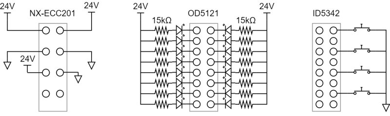

# ArduinoでオムロンのEtherCATユニットを制御

Arduino系マイコンボードでオムロンのEtherCATスレーブターミナルNXシリーズを制御するデモ

## マスター
- ハードウェア: [SOEM4Arduino](https://github.com/lipoyang/SOEM4Arduino) がサポートするArduino系マイコンボード
- 依存ライブラリ: [SOEM4Arduino](https://github.com/lipoyang/SOEM4Arduino)
- スケッチ: [OmronNX_Demo/OmronNX_Demo.ino](OmronNX_Demo/OmronNX_Demo.ino)

## スレーブ
- ハードウェア: オムロン EtherCATスレーブターミナルNXシリーズ
    - NX-ECC201: EtherCATカプラユニット
    - NX-OD5121: デジタル出力ユニット (16接点, NPN出力)
    - NX-ID5342: デジタル入力ユニット (16接点, NPN入力)

<!-- 
## 動画

-->
